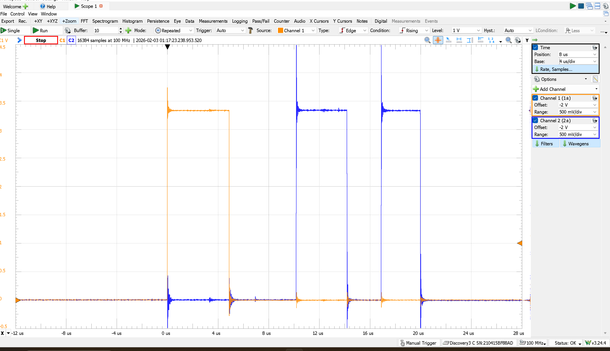

## Embedded neural network implementation

This project is part of my embedded systems portfolio. I trained a small XOR neural network in TensorFlow and Scikit-learn to get the weights and biases. I then reimplemented the network in C as a generic layer with a user-defined architecture. This floating-point version served as the baseline. I chose a custom C implementation instead of LiteRT because it gave me more control over memory use and made debugging easier on an embedded target. I then converted the design to fixed-point integers to reduce flash use, lower power use, and increase speed.

## Performance results

| Function      | Optimization | Execution Time | Flash (text) | RAM (data + BSS) |
|---------------|--------------|----------------|--------------|------------------|
| `nn_predict`  | `-O0`        | 275 us         | 27212 Bytes  | 856 Bytes        |
| `nn_qpredict` | `-O0`        | 20 us          | 8024 Bytes   | 488 Bytes        |
| `nn_qpredict` | `-O3`        | 2.12 us        | 6972 Bytes   | 488 Bytes        |

Compared with `nn_predict` at `-O0`, `nn_qpredict` at `-O0` is about 13.75x faster, uses about 70.5% less flash, and uses about 43.0% less RAM.  
Changing `nn_qpredict` from `-O0` to `-O3` reduces execution time from 20 us to 2.12 us, which is about a 9.43x speedup, while flash usage drops by about 13.1%.  
RAM stays the same at 488 Bytes between `-O0` and `-O3`, so the optimization mainly improves speed and slightly reduces code size.  

## Interrupt timing measurement

I also measured the interrupt-driven ADC version on hardware. The goal of this measurement was to separate software time from ADC conversion time and to verify that the interrupt flow behaved as expected. I took the timing measurements by toggling GPIO pins inside the interrupt handlers.

Channel 1 shows how long the `SysTick` callback runs. Its pulse is wider because the `SysTick` handler does more work. It starts the ADC sequence and handles more control logic before returning.

Channel 2 shows how long the `ADC` callback runs when a conversion finishes. These pulses are shorter because the ADC interrupt handler does much less work. It mostly reads the ADC value from the data register and stores it. The two Channel 2 pulses are slightly different because the first interrupt handles the `CH0` case and starts the next conversion on `CH1`, while the second interrupt mainly reads the `CH1` result and finishes the sequence.

The equal spacing between the end of the Channel 1 pulse and the start of the first Channel 2 pulse, and then between the end of the first Channel 2 pulse and the start of the second Channel 2 pulse, shows that the same process is happening in both intervals. These intervals are the ADC conversion times. During this time, the ADC hardware is performing the conversion in the background and then raising the interrupt flag when the result is ready. The duration is the same because both conversions use the same ADC settings, clock, and sample timing.

This project is based on coursework from [ENGS-62](https://engineering.dartmouth.edu/courses/engs62) at Dartmouth's [Thayer School of Engineering](https://engineering.dartmouth.edu/).

